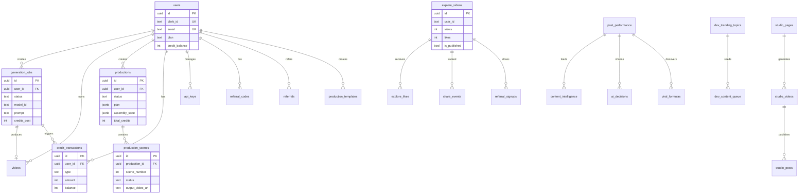

# Genesis Studio — Data Model

**Audit date:** 2026-04-25

---

## 2.1 Schema Overview

The database uses Supabase PostgreSQL with **24+ tables** across 5 domains:

1. **Core**: users, generation_jobs, videos, credit_transactions, api_keys
2. **Brain Studio**: productions, production_scenes, production_templates
3. **Community**: explore_videos, explore_likes, share_events, referral_signups
4. **Intelligence**: post_performance, content_intelligence, ai_decisions, viral_formulas, feedback_system_logs
5. **Studio/Dev**: dev_trending_topics, dev_content_queue, dev_generation_costs, studio_pages, studio_trends, studio_videos, studio_posts
6. **Monetization**: referral_codes, referrals, affiliate_referrals, affiliate_payouts, dunning_records, webhook_events

Row counts: **UNKNOWN — requires operator to run inventory-tables script or SQL query.**

### Operator Action Required

Run this in Supabase SQL Editor:
```sql
SELECT table_name FROM information_schema.tables WHERE table_schema = 'public' ORDER BY table_name;
```

And for row counts:
```sql
SELECT schemaname, relname, n_live_tup FROM pg_stat_user_tables ORDER BY n_live_tup DESC;
```

---

## 2.2 Key Tables (detailed schema from code + migrations)

### `users`
| Column | Type | Notes |
|--------|------|-------|
| id | UUID PK | |
| clerk_id | TEXT UNIQUE | Auth integration |
| email | TEXT UNIQUE | |
| name | TEXT | |
| avatar_url | TEXT | |
| plan | TEXT | CHECK: free, creator, pro, studio |
| stripe_customer_id | TEXT UNIQUE | |
| stripe_subscription_id | TEXT UNIQUE | |
| credit_balance | INTEGER | Default: 50 |
| monthly_credits_used | INTEGER | Default: 0 |
| monthly_credits_limit | INTEGER | Default: 50 |
| created_at, updated_at | TIMESTAMPTZ | |

### `generation_jobs`
| Column | Type | Notes |
|--------|------|-------|
| id | UUID PK | |
| user_id | UUID FK → users | |
| status | TEXT | queued/processing/completed/failed/cancelled |
| type | TEXT | t2v/i2v/v2v/motion |
| model_id, prompt, negative_prompt | TEXT | |
| input_image_url, input_video_url | TEXT | |
| resolution, duration, fps, seed | Various | |
| credits_cost | INTEGER | |
| output_video_url, thumbnail_url | TEXT | |
| runpod_job_id | TEXT | |
| gpu_time | REAL | |
| aspect_ratio | TEXT | Added in migration |
| audio_track_id, audio_url | TEXT | Added in migration |

### `productions` (Brain Studio)
| Column | Type | Notes |
|--------|------|-------|
| id | UUID PK | |
| user_id | UUID FK → users | |
| status | TEXT | planning/planned/generating/assembling/completed/failed/cancelled |
| concept, style | TEXT | |
| plan | JSONB | Full ScenePlan |
| assembly_state | JSONB | Complex state machine (25+ fields) |
| voiceover_url, music_url, captions_url | TEXT | |
| output_video_urls | TEXT | JSON: {landscape: url, portrait: url} |
| total_credits, progress | INTEGER | |

### `explore_videos`
| Column | Type | Notes |
|--------|------|-------|
| id | UUID PK | |
| views, likes, recreates, shares | INTEGER | Atomic increment via RPC |
| is_published, is_featured, is_flagged | BOOLEAN | |
| tags | TEXT[] | Array |
| creator_name, creator_avatar_url | TEXT | |

**RPC Functions:**
- `get_trending_explore_videos()` — Calculates trending score: `likes*3 + views*1 + recreates*5 + recency_bonus`
- `increment_explore_field()` — Atomic field increment

---

## 2.3 Migration History

| File | Date | Changes |
|------|------|---------|
| `supabase-schema.sql` | Initial | Core: users, generation_jobs, videos, productions, credit system, referrals, api_keys |
| `supabase-migration-reels-audio.sql` | ~2025-04 | Added aspect_ratio, audio_track_id, audio_url to jobs + videos |
| `supabase-migration-intelligence.sql` | ~2025-04 | Intelligence tables: post_performance, content_intelligence, ai_decisions, viral_formulas |
| `20260405_explore_system.sql` | 2026-04-05 | Explore feed: explore_videos, explore_likes, share_events, referral_signups + RPC functions |
| `20260407_assembly_state.sql` | 2026-04-07 | Added assembly_state JSONB column to productions |
| `20260412_intelligence_tables.sql` | 2026-04-12 | **DUPLICATE** of intelligence migration (same content) |

**Note:** `20260412_intelligence_tables.sql` appears to be a duplicate of `supabase-migration-intelligence.sql`. This could cause issues if both are applied.

---

## 2.4 ER Diagram


