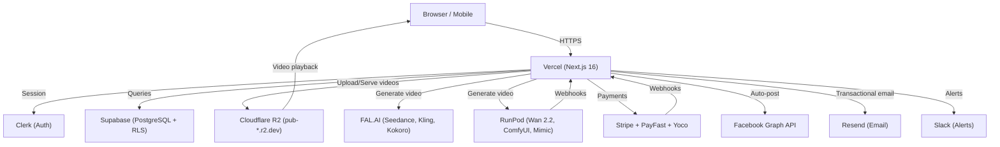

# Genesis Studio Architecture

## System Overview

## Data Flow: Video Generation

1. User submits prompt via `/api/generate`
2. Credits deducted (or owner bypass)
3. Job created in `generation_jobs` table (status: queued)
4. Request sent to FAL.AI or RunPod (async)
5. Client polls `/api/jobs/[jobId]` every 3s
6. On provider completion:
   - Video downloaded from provider URL
   - Uploaded to R2 (`videos/{userId}/{jobId}.mp4`)
   - Video record created in `videos` table
   - Job status updated to completed
   - Thumbnail extracted and uploaded
7. Client receives completed status with video URL
8. Video served via `/api/videos/[videoId]` → 302 to R2 public URL

## Key Tables

- `users` — Clerk-linked user profiles, credit balance, plan
- `generation_jobs` — async job tracking (queued → processing → completed/failed)
- `videos` — generated video metadata, R2 storage keys
- `credit_transactions` — full debit/credit ledger
- `productions` — Brain Studio multi-scene productions
- `explore_videos` — public community feed
- `mbs_*` — automated content pipeline (Mzansi Baby Stars)

## Cron Jobs (Vercel)

| Schedule | Route | Purpose |
|---|---|---|
| */1 * * * * | /api/cron/process-mbs-queue | Process MBS automation queue |
| */1 * * * * | /api/cron/process-fallbacks | Retry failed generations |
| */5 * * * * | /api/cron/recover-scenes | Recover stuck Brain scenes |
| */15 * * * * | /api/cron/vet-candidates | Vet discovered content |
| */30 * * * * | /api/cron/discover-content | Discover trending content |
| 0 */6 * * * | /api/cron/purge-stale | Purge stale jobs |
| 0 3 * * * | /api/cron/cleanup-storage | Clean orphaned R2 files |
| 0 5,13 * * * | /api/cron/content-pipeline | Full content pipeline run |
| 0 9 * * * | /api/cron/dunning | Payment dunning emails |

## Auth Model

- **Clerk** handles sign-up, sign-in, session management
- **proxy.ts** (Next.js 16 middleware) protects dashboard routes via `auth.protect()`
- **API routes** are public at middleware level; each handler calls `auth()` for user context
- **Owner accounts** bypass credit deduction (OWNER_CLERK_IDS env var)
- **Cron routes** authenticate via CRON_SECRET header
- **Webhook routes** verify provider-specific signatures
